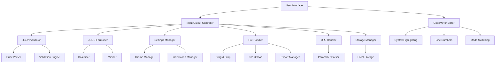

# JSON Validator & Formatter - Architecture Plan

## System Overview

The JSON Validator & Formatter is a single-page static website that validates and formats JSON data entirely in the browser. The application features a single content area that switches between input and output modes, providing a clean and focused user experience.

## Architecture Diagram



## Technical Stack

### Frontend Technologies
- **HTML5**: Semantic markup, accessibility features
- **CSS3**: Responsive design, animations, transitions
- **Vanilla JavaScript**: Core functionality, no framework dependencies
- **CodeMirror 6**: Advanced code editing with syntax highlighting

### External Dependencies (CDN)
- CodeMirror 6 for code editing
- Custom CSS for styling (no external CSS framework)

## File Structure

```
project/
│
├── index.html              # Main HTML file with semantic structure
├── css/
│   ├── style.css           # Main stylesheet
│   ├── theme.css           # Light/dark theme styles
│   └── responsive.css      # Media queries for responsive design
├── js/
│   ├── main.js             # Application entry point
│   ├── validator.js        # JSON validation logic
│   ├── formatter.js        # Format/minify functions
│   ├── ui.js               # UI interactions and mode switching
│   ├── settings.js         # Settings management
│   ├── fileHandler.js      # File upload/export functionality
│   ├── urlHandler.js       # URL parameter processing
│   ├── storage.js          # Local storage management
│   └── keyboard.js         # Keyboard shortcuts
└── assets/
    └── icons/              # Icons and images
```

## Core Components

### 1. Input/Output Controller
Manages the single content area that switches between input and output modes:
- Handles mode transitions with smooth animations
- Maintains state for current mode
- Coordinates with validator and formatter components

### 2. JSON Validator
Validates JSON syntax and provides detailed error messages:
- Uses native JSON.parse() for validation
- Extracts line numbers and character positions from errors
- Categorizes error types for better user understanding

### 3. JSON Formatter
Handles beautifying and minifying JSON:
- Beautifier: Adds proper indentation and line breaks
- Minifier: Removes unnecessary whitespace
- Configurable indentation size (2, 4 spaces, or tab)

### 4. CodeMirror Integration
Provides advanced editing features:
- Syntax highlighting for JSON
- Line numbers display
- Mode switching between editable and read-only
- Custom themes for light/dark modes

## User Interface Design

### Layout Structure
- Header with title and tagline
- Single content area (max-width: 1200px, centered)
- Action buttons above the content area
- Status bar below the content area
- Settings panel (toggleable)

### Responsive Design
- Desktop: Full-width layout with centered content
- Tablet: Adjusted spacing and button sizes
- Mobile: Stacked layout with simplified controls

### Color Scheme
- Light mode: Clean white background with subtle shadows
- Dark mode: Dark background with high contrast text
- Error states: Red highlighting
- Success states: Green highlighting
- Syntax highlighting: Distinct colors for JSON elements

## State Management

### Application State
```javascript
const appState = {
  mode: 'input' | 'output',
  jsonInput: string,
  jsonOutput: string,
  validationResult: {
    isValid: boolean,
    error: string | null,
    line: number | null,
    column: number | null
  },
  settings: {
    indentation: number | 'tab',
    theme: 'light' | 'dark',
    realTimeValidation: boolean
  }
}
```

## Performance Considerations

### Handling Large JSON Files
- Implement streaming for large files (up to 10MB)
- Use Web Workers for heavy processing
- Debounce real-time validation (300ms delay)
- Lazy load syntax highlighting

### Optimization Strategies
- Minimize DOM manipulations
- Use efficient algorithms for JSON processing
- Implement virtual scrolling for very large outputs
- Cache formatted results when possible

## Accessibility Features

### Keyboard Navigation
- Tab order follows logical flow
- All interactive elements accessible via keyboard
- Keyboard shortcuts for common actions

### Screen Reader Support
- ARIA labels for all interactive elements
- Live regions for status updates
- Semantic HTML structure

### Visual Accessibility
- High contrast themes
- Adjustable font sizes
- Clear focus indicators

## Security Considerations

### Client-Side Processing
- All processing happens in the browser
- No data transmission to servers
- Safe handling of user-provided JSON

### Input Sanitization
- Validate JSON before processing
- Prevent XSS attacks
- Safe handling of malformed JSON

## Browser Compatibility

### Supported Browsers
- Chrome 90+
- Firefox 88+
- Safari 14+
- Edge 90+

### Graceful Degradation
- Fallback to basic textarea if CodeMirror fails
- Reduced functionality for older browsers
- Clear messaging about unsupported features

## Testing Strategy

### Functional Testing
- Valid JSON validation
- Various error scenarios
- Large file handling
- File upload/export

### Performance Testing
- Large JSON processing time
- Memory usage
- Responsiveness during processing

### Cross-Browser Testing
- Layout consistency
- Feature compatibility
- Performance across browsers

### Accessibility Testing
- Keyboard navigation
- Screen reader compatibility
- Visual accessibility

## Future Enhancements

### Potential Features
- JSON Schema validation
- JSON diff/comparison tool
- JSON Path query tester
- Tree view with collapsible nodes
- JSON to other format converters

### Implementation Considerations
- Modular architecture for easy extension
- Plugin system for additional features
- API for external integrations